# ConstraintForge 

**The pre-synthesis structural diagnostic engine that catches timing bottlenecks in milliseconds.**

Traditional FPGA and ASIC design flows suffer from massive feedback latency. You make a 1-line RTL change, wait 20 minutes for physical placement and routing, only to realize you failed setup time because your logic depth was 35 gates deep.

ConstraintForge shifts structural timing closure entirely to the left. It bypasses physical synthesis, extracts your Abstract Syntax Tree (AST), and runs a Topological DFS to find your exact setup-time, CDC, and fanout bottlenecks in **under 100 milliseconds**.

[](https://github.com/devtyagi3909/constraintforge/actions) [](https://github.com/devtyagi3909/constraintforge/blob/main/LICENSE) [](https://github.com/devtyagi3909/constraintforge/blob/main/CONTRIBUTING.md)

**[Read the Documentation](https://devtyagi3909.github.io/constraintforge/cli.html)** | **[Timing Calculator](https://devtyagi3909.github.io/constraintforge/timing-calculator.html)** | **[AI Generator](https://devtyagi3909.github.io/constraintforge/ai-generator.html)**

<p align="center">
  
</p>

## The CLI Engine

ConstraintForge invokes headless [Yosys](https://yosyshq.net/yosys/) to parse your Verilog into a Directed Acyclic Graph (DAG). Because it operates strictly on the gate topology rather than physical routing, the algorithm scales deterministically at **$O(|V| + |E|)$**.

### What it flags instantly:
- 🔴 **Setup-Time Risks:** Calculates exact logic depth between registers.
- 🔴 **CDC Violations:** Maps clock domains and traps unsynchronized crossings (missing 2FFs).
- 🔴 **Fanout Bottlenecks:** Flags nets driving >100 loads so you can insert buffer trees early.
- ✅ **Source-Code Back-Annotation:** Maps hazards directly to your exact `.v` line numbers.

### Installation

Install the CLI globally via pip:
```bash
pip install constraintforge
```
*(Requires `yosys` installed and available in your `$PATH`. Run `brew install yosys` on macOS or `apt-get install yosys` on Linux).*

### Quick Start

Run the diagnostic engine on any Verilog or SystemVerilog top module:
```bash
constraintforge diagnose rtl/picorv32.v --top picorv32
```

## Performance Benchmarks

ConstraintForge was benchmarked against Vivado's out-of-context (OOC) Synthesis/STA engine. ConstraintForge successfully finds the exact same critical structural bottlenecks while running **250x to 600x faster**.

| Design | Physical LUTs | Vivado STA (s) | ConstraintForge (s) | Speedup |
| :--- | :--- | :--- | :--- | :--- |
| picorv32 | 933 | 20.0 | **0.08** | 250x |
| aes_core | 266 | 11.0 | **0.04** | 275x |
| darkriscv | 144 | 10.0 | **0.03** | 333x |
| ibex_core | 124 | 11.0 | **0.03** | 366x |
| i2c_master | 27 | 11.0 | **0.02** | 550x |
| spi_master | 21 | 12.0 | **0.02** | 600x |

---

## Legacy Feature: The Constraint Template Library

ConstraintForge originally began as an open-source library of highly annotated `.xdc`, `.sdc`, and `.lpf` timing constraint templates. Those templates are still heavily maintained in this repository.

The official vendor docs are spread across Xilinx UG903, Intel AN433, and Stack Overflow answers from 2013. The `interfaces/` and `boards/` directories in this repo put everything in one place — constraint templates for every interface (SPI, I2C, DDR3, RGMII, MIPI), annotated so you understand what each line does.

You can browse the library visually on our [Interactive Website](https://devtyagi3909.github.io/constraintforge).

## Contributing

Whether you are adding a new diagnostic rule to the CLI Python engine, or submitting a new board constraint file, PRs are welcome. See [CONTRIBUTING.md](https://github.com/devtyagi3909/constraintforge/blob/main/CONTRIBUTING.md).

## License

MIT.
