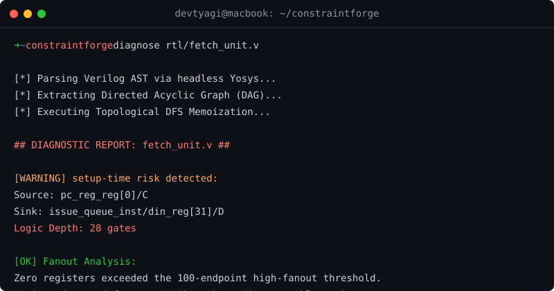

# ConstraintForge 🔨

<p align="center">
  
</p>

**Shift-Left Timing Closure.** 
ConstraintForge is a pre-synthesis structural diagnostic engine. It uses Yosys as a headless AST extractor and executes a deterministic Topological Depth-First Search (DFS) to predict hardware timing bottlenecks *in milliseconds*—saving you from waiting hours for full Vivado Place & Route cycles.

## Why it Exists
Hardware developers face a massive feedback latency. You write Verilog, but you don't know if your logic is too deep (failing setup time) until you run a massive proprietary synthesis flow. 

ConstraintForge ignores silicon physics. It maps your code into a Directed Acyclic Graph (DAG) and counts the gate depth between registers. **If your logic is 30 gates deep, it's going to fail timing on an FPGA.** ConstraintForge tells you exactly where that path is in 0.1 seconds.

## Installation

```bash
pip install constraintforge
```
*Note: You must have [Yosys](https://yosyshq.net/yosys/) installed and available in your system `$PATH`.*

## Quick Start

Run the diagnostic engine directly against any raw Verilog or SystemVerilog file:

```bash
constraintforge diagnose rtl/core.v
```

### Output Example
ConstraintForge instantly identifies the Worst Negative Slack (WNS) structural proxy (Max Logic Depth) and flags high-fanout routing hazards:

```text
[*] Parsing Verilog AST via headless Yosys...
[*] Extracting Directed Acyclic Graph (DAG)...
[*] Executing Topological DFS Memoization...

## DIAGNOSTIC REPORT: core.v ##

[WARNING] setup-time risk detected:
  Source:      pc_reg_reg[0]/C
  Sink:        issue_queue_inst/din_reg[31]/D
  Logic Depth: 28 gates

[OK] Fanout Analysis:
  Zero registers exceeded the 100-endpoint high-fanout threshold.
  Maximum detected fanout: 14 (branch_predictor_enable_reg)
```

## Academic Validation
ConstraintForge's DFS topological limit has been mathematically correlated against Vivado 2023.1 Static Timing Analysis (STA) on physical Xilinx Artix-7 silicon, achieving an $R^2 = 0.944$ correlation to physical nanosecond delay with an average speedup of **200x** over traditional physical compilation.

## License
MIT License.
